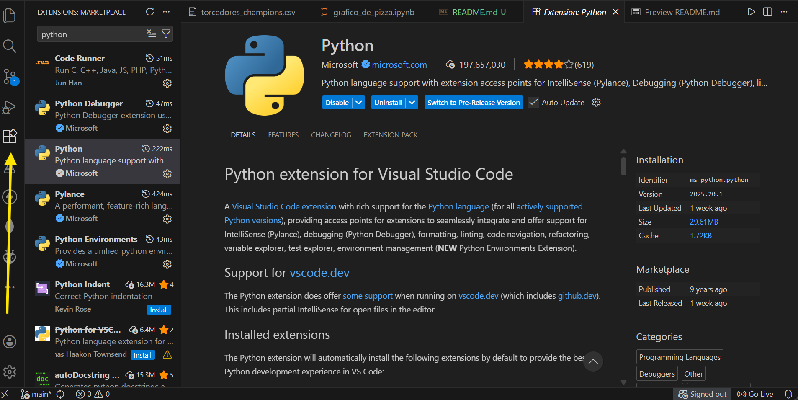

# 📊 Gráfico de Pizza a partir de CSV (Python e Jupyter Notebook)
Este repositório demonstra, de forma simples e didática, como criar um gráfico de pizza em Python utilizando dados de um arquivo CSV, com as bibliotecas Pandas e Matplotlib.  
O projeto foi desenvolvido utilizando Jupyter Notebook (.ipynb), executado diretamente no VS Code.


## 🎯 Objetivo educacional
Este projeto é ideal para:
- Iniciantes em Python;
- Estudantes aprendendo análise e visualização de dados;
- Praticar leitura de arquivos CSV;
- Criar gráficos com Matplotlib.


## 🧠 Conceitos abordados

- Importação de bibliotecas (pandas e matplotlib);
- Leitura de arquivos .csv com Pandas;
- Manipulação de colunas de um DataFrame;
- Criação de gráfico de pizza (pie chart);
- Personalização básica de gráficos.


## 📦 Bibliotecas utilizadas

```python
import pandas as pd
import matplotlib.pyplot as plt
```

- Pandas: biblioteca para leitura e manipulação de dados;
- Matplotlib: biblioteca para criação de gráficos.


## 🚀 Como executar o código
Este projeto utiliza Jupyter Notebook (.ipynb) e pode ser executado diretamente no VS Code, sem necessidade de abrir o Jupyter no navegador.
1. Certifique-se de ter instalado o VS Code e o Git no seu computador.
2. Clone este repositório pelo terminal do VS Code por meio do seguinte comando:
```bash
git clone https://github.com/luanalima77/Como-criar-grafico-de-pizza-no-Python.git
```
3. Acesse a pasta do projeto por meio do seguinte comando no terminal do VS Code:
```bash
cd Como-criar-grafico-de-pizza-no-Python
```
<br>

4. Instale as extensões do Python e do Jupyter Notebook no VS Code (figuras 1 e 2):
<div align = "center">
    <p>Figura 1 - Extensão do Python no VS Code</p>
    
    <p>Fonte: material retirado do VS Code pela autora (2025).</p>
</div>
<br>

<div align = "center">
    <p>Figura 2 - Extensão do Jupyter Notebook no VS Code</p>
    
    <p>Fonte: material retirado do VS Code pela autora (2025).</p>
</div>
<br>

5. Abra o arquivo .ipynb no VS Code.
6. Execute as células clicando em Run All.
7. Selecione o kernel Python (o VS Code sugere automaticamente).

O gráfico de pizza será exibido diretamente no VS Code.
<br>

### ✍️ Projeto com fins educacionais
